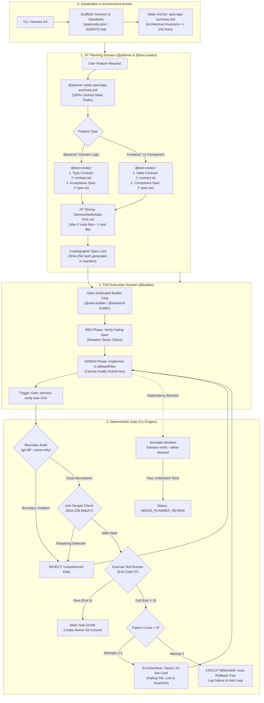

# AI Workflow Harness — Architectural Handover & Specifications

## 1. End-to-End System Lifecycle



---

## 2. Model Allocation Strategy

| Role | Complex — Best | Complex — Efficient (Recommended) | Small — Efficient |
| :--- | :--- | :--- | :--- |
| **@planner** | `anthropic/claude-3.5-sonnet` | `deepseek/deepseek-r1` or `z-ai/glm-5.2` | `z-ai/glm-5.2` |
| **@test-creator** | `anthropic/claude-3.5-sonnet` | `qwen/qwen-2.5-coder-32b-instruct` | `qwen/qwen-2.5-coder-32b-instruct` |
| **@builder** (Web / Mobile / Node) | `anthropic/claude-3.5-sonnet` | `qwen/qwen-2.5-coder-32b-instruct` | `qwen/qwen-2.5-coder-32b-instruct` |
| **@test-runner** | `google/gemini-2.5-flash` | `google/gemini-2.5-flash` | `google/gemini-2.5-flash` |

---

## 3. Micro-Task Manifest Schema (`.harness/tasks/task-XXX.md`)

```markdown
---
id: "task-001"
title: "Implement user authentication state handler"
stack: "node"
status: "TODO"
---

# Task: Implement User Authentication State Handler

## 1. Allowed File Boundaries
> **Constraint:** Agent may ONLY modify or create the files listed below:
- `src/features/auth/auth.service.ts`
- `src/features/auth/auth.spec.ts`

## 2. Acceptance Criteria
- [ ] AC-1: Given valid credentials, When `login()` is called, Then return signed JWT and status 200.
- [ ] AC-2: Given expired token, When `verifyToken()` is called, Then throw `AuthenticationExpiredError`.

## 3. Verification Commands
```bash
bun test src/features/auth/auth.spec.ts
```
```

---

## 4. CLI Surface Specification

- `harness init`: Scaffolds the `.harness/` directory, templates, and compiles tool adapters (`opencode.json`, `AGENTS.md`).
- `harness verify <taskId> [--allow-blocked]`: Enforces file boundaries, performs cryptographic anti-tamper hash checks, runs the test command with `ErrorSanitizer`, and triggers a 3-strike circuit breaker rollback on repeated failures. If `--allow-blocked` is specified, skipped tests are routed to `NEEDS_PLANNER_REVIEW`.