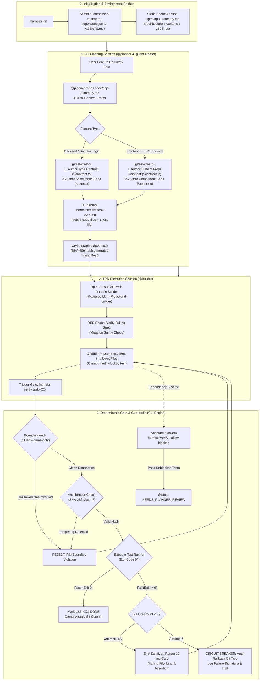

# 01. End-to-End System Lifecycle

```mermaid
flowchart TD
    subgraph Setup ["0. Initialization & Environment Anchor"]
        A["harness init"] --> B["Scaffold .harness/ & Standards<br/>(opencode.json / AGENTS.md)"]
        B --> C["Static Cache Anchor: spec/app-summary.md<br/>(Architecture Invariants &le; 150 lines)"]
    end

    subgraph Planning ["1. JIT Planning Session (@planner & @test-creator)"]
        D["User Feature Request / Epic"] --> E["@planner reads spec/app-summary.md<br/>(100% Cached Prefix)"]
        E --> F{"Feature Type"}
        F -->|"Backend / Domain Logic"| G["@test-creator:<br/>1. Author Type Contract (*.contract.ts)<br/>2. Author Acceptance Spec (*.spec.ts)"]
        F -->|"Frontend / UI Component"| H["@test-creator:<br/>1. Author State & Props Contract (*.contract.ts)<br/>2. Author Component Spec (*.spec.tsx)"]
        G --> I["JIT Slicing: .harness/tasks/task-XXX.md<br/>(Max 2 code files + 1 test file)"]
        H --> I
        I --> J["Cryptographic Spec Lock<br/>(SHA-256 hash generated in manifest)"]
    end

    subgraph Execution ["2. TDD Execution Session (@builder)"]
        J --> K["Open Fresh Chat with Domain Builder<br/>(@web-builder / @backend-builder)"]
        K --> L["RED Phase: Verify Failing Spec<br/>(Mutation Sanity Check)"]
        L --> M["GREEN Phase: Implement in allowedFiles<br/>(Cannot modify locked test)"]
        M --> N["Trigger Gate: harness verify task-XXX"]
    end

    subgraph Verification ["3. Deterministic Gate & Guardrails (CLI Engine)"]
        N --> O{"Boundary Audit<br/>(git diff --name-only)"}
        O -->|"Unallowed files modified"| P["REJECT: File Boundary Violation"]
        P --> M
        O -->|"Clean Boundaries"| Q{"Anti-Tamper Check<br/>(SHA-256 Match?)"}
        Q -->|"Tampering Detected"| P
        Q -->|"Valid Hash"| R{"Execute Test Runner<br/>(Exit Code 0?)"}
        
        R -->|"Pass (Exit 0)"| S["Mark task-XXX DONE<br/>Create Atomic Git Commit"]
        R -->|"Fail (Exit != 0)"| T{"Failure Count < 3?"}
        
        T -->|"Attempts 1-2"| U["ErrorSanitizer: Return 10-line Card<br/>(Failing File, Line & Assertion)"]
        U --> M
        T -->|"Attempt 3"| V["CIRCUIT BREAKER: Auto-Rollback Git Tree<br/>Log Failure Signature & Halt"]
        
        M -.->|"Dependency Blocked"| W["Annotate blockers<br/>harness verify --allow-blocked"]
        W -->|"Pass Unblocked Tests"| X["Status: NEEDS_PLANNER_REVIEW"]
    end

    Setup --> Planning
    Planning --> Execution
```