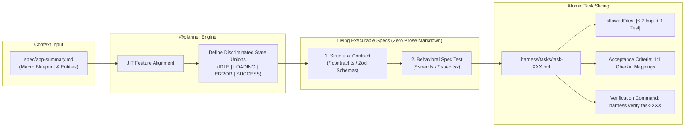

# 02. Executable Specifications & Slicing Pipeline (Tests-as-Docs)

```mermaid
flowchart LR
    subgraph Input ["Context Input"]
        A["spec/app-summary.md<br/>(Macro Blueprint & Entities)"]
    end

    subgraph Planner ["@planner Engine"]
        A --> B["JIT Feature Alignment"]
        B --> C["Define Discriminated State Unions<br/>(IDLE | LOADING | ERROR | SUCCESS)"]
    end

    subgraph LivingDocs ["Living Executable Specs (Zero Prose Markdown)"]
        C --> D["1. Structural Contract<br/>(*.contract.ts / Zod Schemas)"]
        D --> E["2. Behavioral Spec Test<br/>(*.spec.ts / *.spec.tsx)"]
    end

    subgraph TaskManifest ["Atomic Task Slicing"]
        E --> F[".harness/tasks/task-XXX.md"]
        F --> G["allowedFiles: [&le; 2 Impl + 1 Test]"]
        F --> H["Acceptance Criteria: 1:1 Gherkin Mappings"]
        F --> I["Verification Command: harness verify task-XXX"]
    end
```