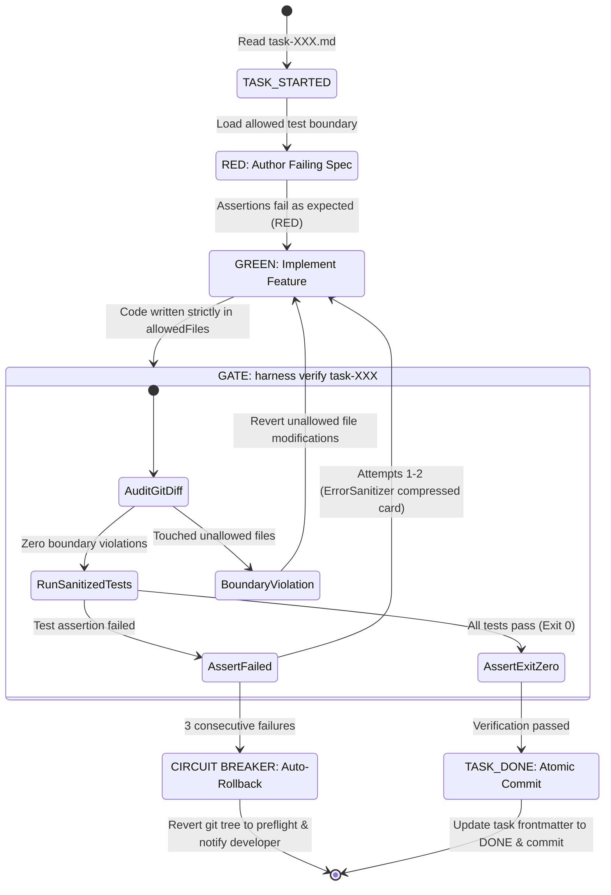

# 03. Verification Gate & Circuit Breaker State Machine

```mermaid
stateDiagram-v2
    [*] --> TASK_STARTED: Read task-XXX.md

    state "RED: Author Failing Spec" as RED_PHASE
    state "GREEN: Implement Feature" as GREEN_PHASE
    state "GATE: harness verify task-XXX" as VERIFY_GATE
    state "CIRCUIT BREAKER: Auto-Rollback" as CIRCUIT_BREAKER
    state "TASK_DONE: Atomic Commit" as DONE_STATE

    TASK_STARTED --> RED_PHASE: Load allowed test boundary
    RED_PHASE --> GREEN_PHASE: Assertions fail as expected (RED)
    GREEN_PHASE --> VERIFY_GATE: Code written strictly in allowedFiles

    state VERIFY_GATE {
        [*] --> AuditGitDiff
        AuditGitDiff --> RunSanitizedTests: Zero boundary violations
        AuditGitDiff --> BoundaryViolation: Touched unallowed files
        RunSanitizedTests --> AssertExitZero: All tests pass (Exit 0)
        RunSanitizedTests --> AssertFailed: Test assertion failed
    }

    BoundaryViolation --> GREEN_PHASE: Revert unallowed file modifications
    AssertFailed --> GREEN_PHASE: Attempts 1-2 (ErrorSanitizer compressed card)
    
    AssertFailed --> CIRCUIT_BREAKER: 3 consecutive failures
    CIRCUIT_BREAKER --> [*]: Revert git tree to preflight & notify developer

    AssertExitZero --> DONE_STATE: Verification passed
    DONE_STATE --> [*]: Update task frontmatter to DONE & commit
```