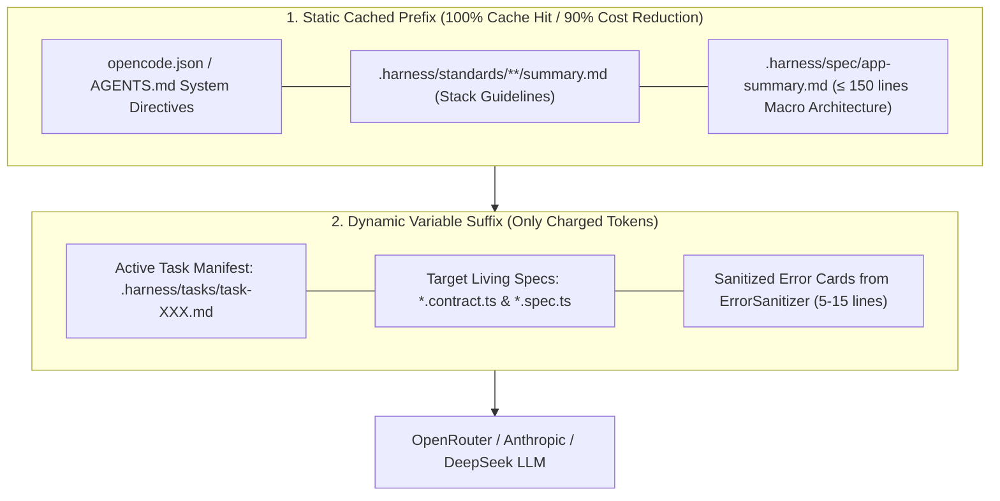

# 04. Token Efficiency & Context Caching Architecture

```mermaid
flowchart TD
    subgraph CachedPrefix ["1. Static Cached Prefix (100% Cache Hit / 90% Cost Reduction)"]
        A["opencode.json / AGENTS.md System Directives"]
        B[".harness/standards/**/summary.md (Stack Guidelines)"]
        C[".harness/spec/app-summary.md (&le; 150 lines Macro Architecture)"]
        A --- B --- C
    end

    subgraph DynamicSuffix ["2. Dynamic Variable Suffix (Only Charged Tokens)"]
        D["Active Task Manifest: .harness/tasks/task-XXX.md"]
        E["Target Living Specs: *.contract.ts & *.spec.ts"]
        F["Sanitized Error Cards from ErrorSanitizer (5-15 lines)"]
        D --- E --- F
    end

    CachedPrefix --> DynamicSuffix
    DynamicSuffix --> G["OpenRouter / Anthropic / DeepSeek LLM"]
```