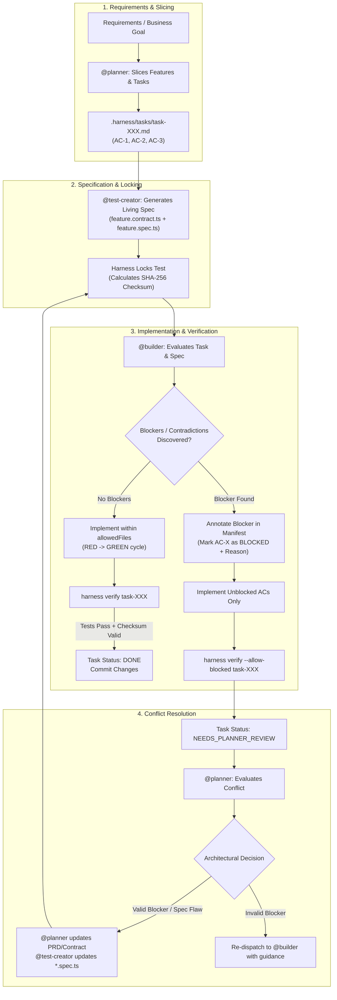

# Clean-Room Specification Lifecycle

The AI Workflow Harness uses a **Clean-Room Specification** (Dual-Role) pattern. This separates the generation of Acceptance Criteria (AC) tests from the implementation code, preventing autonomous agents from gaming tests or creating false positives.

